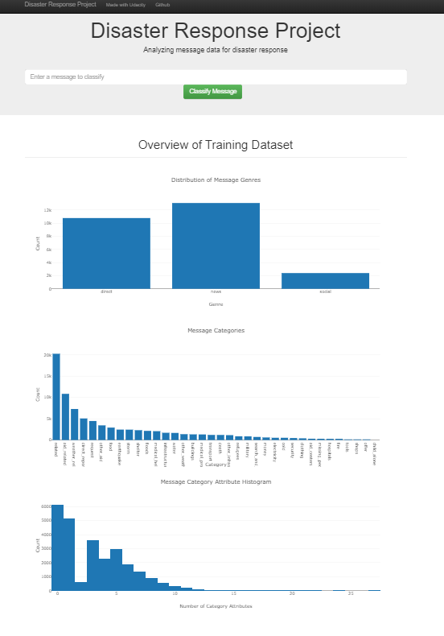
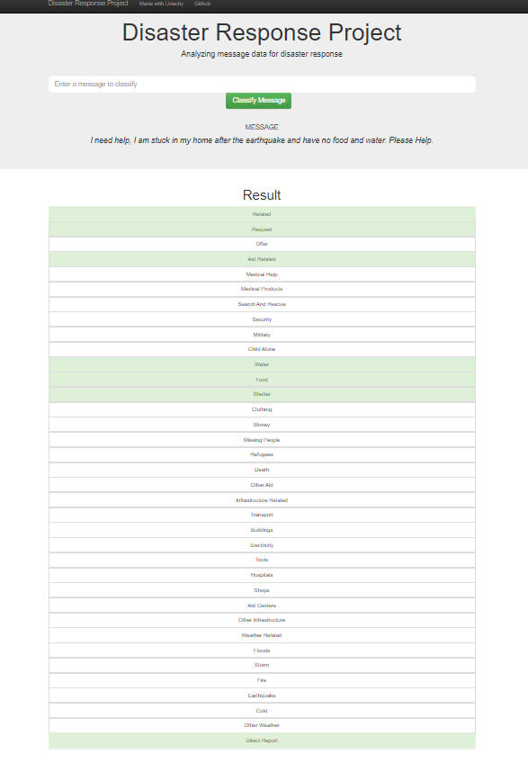

# Disaster Response Pipeline Project

This project aims at analyzing disaster messages using ETL, ML and NLP pipeline.

The project consists of 3 phases:

1- Extracting, transforming and loading the data, then, preprocessing data to be ready for the modeling phase.

2- Modeling the data to classify the disaster data messages through ML and NLP pipelines to automate the process.

3- Building a simple web app to visualize the results 

## Instructions to run the project

1. Run the following commands in the project's root directory to set up the database and model.

    - To run ETL pipeline that cleans data and stores in database
        `python data/process_data.py data/disaster_messages.csv data/disaster_categories.csv data/DisasterResponse.db`
    - To run ML pipeline that trains classifier and saves
        `python models/train_classifier.py data/DisasterResponse.db models/classifier.pkl`

2. Run the following command in the app's directory to run the web app.
    `python run.py`
    
3. Go to http://0.0.0.0:3001/

## Packages and installation required

- sklearn
- nltk
- pandas
- numpy
- joblib
- re
- flask
- sqlalchemy

## Web App output

### Main Page

### Text classification

## Data

More information about the data can be found <a href = 'https://appen.com/datasets/combined-disaster-response-data/' > here </a>

## License

Credit go to Udacity for the idea and the starter code